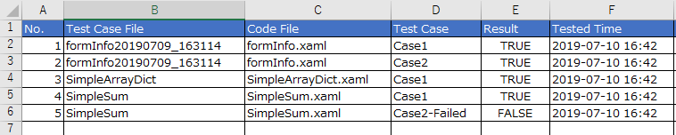

- [UiPath AutomationTestRobot](#uipath-automationtestrobot)
  - [Inspiration](#inspiration)
  - [What it does](#what-it-does)
  - [How I built it](#how-i-built-it)
  - [Challenges I ran into](#challenges-i-ran-into)
  - [What's next for Automation Test Robot](#whats-next-for-automation-test-robot)
- [Getting Started](#getting-started)
  - [Configure src/config/config.xlsx](#configure-srcconfigconfigxlsx)
  - [Try sample test cases in test_cases_sample/](#try-sample-test-cases-in-test_cases_sample)
  - [Test your own workflow .xaml files](#test-your-own-workflow-xaml-files)
  - [Build your own CICD environment](#build-your-own-cicd-environment)
  - [Have fun](#have-fun)

# UiPath AutomationTestRobot
Without any more coding, you can automate testing your UiPath projects. This project enables test driven development in UiPath.

## Inspiration
Testing in UiPath was horrible as you have to manually edit your (in/out) arguments every time, then click RUN button.
While most of programing languages provide testing frameworks and CICD approach, workflow-style UiPath codes are lacking of these.
My objective is to qualify UiPath codes by enabling automated tests and CICD approach.

## What it does
* 1. Automate generating test-case (template in excel) for each .xaml file, so you can input your test data (with In/Out arguments). All you do in excel.
    

* 2. Automate running all your test cases and reporting results
    

* 3. You can choose test only 1 case, or all cases at once.
    

* 4. Generate its own log files (besides UiPath Robot log), for furthur analyzing test result in CICD in the future version.
    

* 5. Build your CICD by running the AutomationTestRobot as unattended for automating testing your continuous UiPath development.

## How I built it 
I wrote the Automation Test Robot just by UiPath only, without external library. So it is compatible with any environment, and easy to execute. Run it in your studio, or publish it as robot.

## Challenges I ran into
* 1. UiPath .xaml file invoke codes by relative path in its projects (not relative path of the two files). So, in the beginning, I was just able to test no-invoke-other-workflow file.
-> now supported nested-invoke-workflow files.
* 2. Check coding standards is quite challenging in .xaml workflow. Some basic rules may be: no generic-value type, variable names rules, maximum numbers of out arguments, etc. More complicated rules are no too-much-nested sequences, independent in business logic workflow, etc. Noted: not yet implement this challenge.

## What's next for Automation Test Robot
* 1. TODO: scan UiPath codes (.xaml) to check coding standards
* 2. TODO: resolve dependences (between workflows, like: workflow A must run before workflow B)

# Getting Started

## Configure src/config/config.xlsx
Configure all settings in the "**Settings**" sheet of config.xlsx before running the robot.

1. **TestCaseFolderPath**: set a folder of your test cases files (default: *C:\AutomationTestRobot\TestCase*)
2. **WorkingFolderPath**: set a folder for the AutomationTestRobot creating its own temp files (default: *C:\AutomationTestRobot\Working*)
3. **TestResultFolderPath**: set a folder to save test result files (default: C:\AutomationTestRobot\TestResult)
4. **GeneratedTestCaseFolderPath**: set a folder for the AutomationTestRobot to save generated test cases template files (default: *C:\AutomationTestRobot\GeneratedTestCase*)
5. **ErrorScreenshotFolderPath**: set a folder for the AutomationTestRobot to save screenshot when it caught unexpected exception  (default: *C:\AutomationTestRobot\Error*)
6. **LogFolderPath**: set a folder for the AutomationTestRobot to log its own log information (default: *C:\AutomationTestRobot\Logs*)
7. **Unattended**: choose your "Unattended mode" or "Attended mode". if FALSE, the AutomationTestRobot runs in attended mode, which shows popup for you to choose which sub-robot to run. Otherwise, TRUE, the AutomationTestRobot runs the Sub-Robot1.
  * **Sub-Robot 1**: Execute all your test cases
  * **Sub-Robot 2**: Execute just one test case (you pickup later)
  * **Sub-Robot 3**: Generate test cases template by scanning a UiPath codes folder (you pickup later)
8. **ShowInformationForm**: In Unattended mode, this is always FALSE. In attended mode, if ShowInformationForm is TRUE, the AutomationTestRobot will show a WinForm to show current status (for reference)

## Try sample test cases in test_cases_sample/
1. Edit the "**Settings**" sheet of each .xlsx test case file and set B2 value to the actual .xaml file path at your local PC.
2. Put those test cases at the folder you set in "**TestCaseFolderPath**" in *src/config/config.xlsx*
3. Run the robot, choose **Sub-Robot 1**
4. Check the folder "**TestResultFolderPath**" to see tested result.
5. Check the folder "**LogFolderPath**" to see test log.

## Test your own workflow .xaml files
1. Set "**Unattended**" = FALSE in *src/config/config.xlsx*, then run the robot, choose Sub-Robot 3 and select your workflow folder.
2. Next, edit the generated test case files at "**GeneratedTestCaseFolderPath**" (generated in the first step above), input your test data.
3. Next, set name for each test case by editing the sheet names. *Note*: each sheet name, except **Settings**, will be the name of the test case. Please set only windows-file-name-compatible name for avoiding any unexpected error (for safer, set only characters in [a-zA-Z0-9-_]).
4. Next Move completed test case files to the folder "**TestCaseFolderPath**", then close all excel windows
5. Then, run the robot, choose *Sub-Robot 1* (or 2), have a coffee, and see your tested result.

## Build your own CICD environment
Just set Unattended=TRUE in *src/config/config.xlsx*, publish it as a robot, schedule the automation test, and manage the TestResult.xlsx and TestLog files in your own productive way :)

## Have fun
Customize the robot with your own needs and share it to community :)
